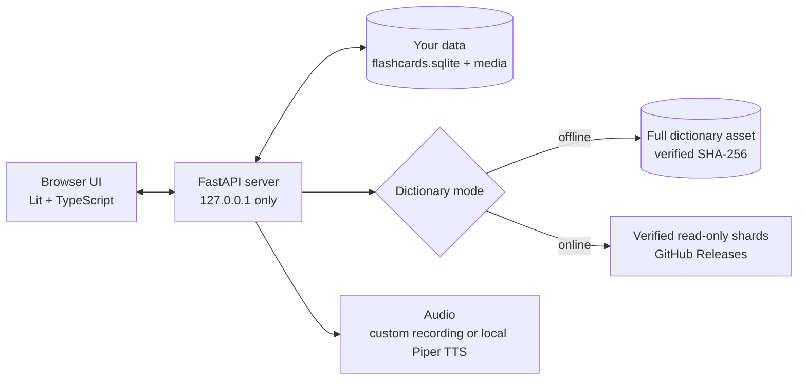

# Wortlaut

[](https://github.com/sabers13/wortlaut-app/actions/workflows/ci.yml)
[](LICENSE)
[](release/ATTRIBUTION-v2.md)
[](pyproject.toml)

**An offline-first German flashcard app with its own dictionary, spaced-repetition review, and pronunciation audio.**

Wortlaut runs on your machine. Your decks, reviews, meanings, and recordings stay in a local SQLite database, and the German dictionary is a separate, verified, read-only asset built from Wiktionary and Tatoeba.

> **Core principle: the dictionary is disposable; your learning history is not.**

> [!NOTE]
> **Version 0.1.0.** A single-user, local application for Linux and macOS. It is not a hosted or multi-user service. There is no runtime AI, no telemetry, and no analytics.

---

## What it does

| Feature | What you get |
| --- | --- |
| **Look up and add words** | Search the dictionary, pick the exact sense, and choose German, English, or both meanings |
| **Capture from a sentence** | Paste a sentence, select a word or phrase, and create cards that remember the sentence and a lesson label |
| **Import** | Paste vocabulary lines or load a CSV/text file into a deck |
| **Study** | FSRS scheduling with a 1–5 confidence rating, compact answers, and optional extra grammar and examples |
| **Pronunciation** | Play automatic audio, or record or upload your own pronunciation for any card |
| **Organise** | Decks, folders, moving cards between decks, and changing a card's dictionary sense without losing its history |
| **Export** | Anki `.apkg` (with your audio and meanings) or tab-separated TSV |

---

## How it works



- The **FastAPI backend** owns persistence, scheduling, and dictionary access. It serves a prebuilt frontend, so running the app needs no Node.js.
- **Your data** (decks, notes, cards, review history, meanings, recordings) and the **dictionary** never share a file or a lifecycle. Replacing the dictionary never touches your cards; deleting cards never touches the dictionary.
- In **Offline mode** dictionary lookups stay on your machine. **Online mode** fetches integrity-checked shards on demand instead of installing the full asset.

---

## The dictionary

The dictionary is produced by this project's build pipeline from **German and English Wiktionary** (via Kaikki/Wiktextract dumps) and **Tatoeba** example sentences, then released as a checksummed asset.

| Released dictionary v2 | |
| --- | --- |
| File size | 945,418,240 bytes (~945 MB) |
| Example sentences (Tatoeba, DE/EN) | 777,295 |
| Lemmas linked to example sentences | 99,537 |
| Lemma entries in total | 1,118,636 |
| Senses | 480,221 |
| Sense meanings | 577,191 |
| Online distribution | 577 SHA-256-verified shards |

Provenance is stored on lemma, sense, meaning, and example content through `source` and `license` metadata. The asset also contains 48 meaning rows generated by an LLM **at build time**, each marked `llm_generated_v1` and linked to the source meanings it was derived from. Nothing is generated while you use the app. Full provenance and licensing are in [`release/ATTRIBUTION-v2.md`](release/ATTRIBUTION-v2.md).

---

## Key design decisions

### Durable semantic identity

SQLite row IDs are local to one dictionary build. Wortlaut identifies lemmas and senses by content-derived semantic references that survive rebuilds. Each note owns one duplicate-safe identity key enforced by a partial `UNIQUE` index, so capturing the same word twice reuses the existing card. When a newer dictionary is installed, bindings are relinked and the active version is swapped atomically; cards, meanings, and review history are preserved.

### Stale-safe writes

Every lookup returns a dictionary token. A write carrying a token from a different dictionary generation is rejected, so a card can never be bound against a dictionary it was not picked from.

### History is never deleted by accident

Deleting a deck never cascades into notes with review history. Their memberships are removed and the notes move to a protected **Orphaned** deck, from which they can be restored with identity, scheduling, and history intact.

### Replayable review model

The `review_log` is append-only and stores both your raw 1–5 confidence and the mapped FSRS rating, so the confidence mapping can be revised later by replaying history.

### Verified dictionary, two stages

On every launch, the dictionary's filename, byte size, and streaming SHA-256 are checked before any user data is touched. Full validation (`PRAGMA quick_check` plus schema validation) runs at install time and at runtime activation, against an immutable private snapshot whose hash must match the manifest.

---

## Requirements

- Linux or macOS with **Python 3.11+**
- `libespeak-ng1` for native Piper pronunciation (Debian/Ubuntu: `sudo apt install libespeak-ng1`)
- `git`, and a current Chromium, Firefox, or Safari
- Disk space for the ~945 MB dictionary if you use Offline mode

## Installation

```bash
git clone https://github.com/sabers13/wortlaut-app.git wortlaut
cd wortlaut

# Native pronunciation library (Debian/Ubuntu)
sudo apt install libespeak-ng1

# Python dependencies in a repository-local virtual environment
python3 -m venv .venv
.venv/bin/pip install --upgrade pip
.venv/bin/pip install -e .

# Download and verify the dictionary (once)
./wortlaut --install-dictionary

# Download and verify the German voice model (once)
./wortlaut setup-voice

# Launch
./wortlaut
```

`./wortlaut` re-executes itself through `.venv/bin/python`, so you don't need to activate the environment. The editable install also provides a `wortlaut` console command (`.venv/bin/wortlaut`). `./flashcard`, the product's former name, remains as a compatibility alias.

## Quick start

On first launch, Wortlaut prints its data directory, creates your database from [`reference/schema.sql`](reference/schema.sql), and opens <http://127.0.0.1:8000>.

1. Create a deck.
2. Add words by lookup, by **Capture from a sentence**, or by importing a CSV/text file.
3. Start studying. Each card first shows the headword, part of speech, and IPA.
4. Press **Space** to reveal the answer, **R** to play the pronunciation, and **1–5** to rate how well you knew it:

| Key | Rating |
| :---: | --- |
| 1 | Not at all |
| 2 | Barely |
| 3 | With effort |
| 4 | Comfortably |
| 5 | Without doubt |

Full grammar, more examples, meaning editing, and custom pronunciation live behind **Show extra info**. Tick **Always show extra info** to open it automatically; that preference is stored in your browser only.

### Options

| Flag | Purpose |
| --- | --- |
| `--port N` | Port on `127.0.0.1` (default `8000`) |
| `--no-browser` | Start the server without opening a browser |
| `--dictionary-mode offline\|online` | Choose the dictionary source for this session |
| `--data-dir PATH` | Override the per-user data directory |
| `--install-dictionary` | Download and verify the dictionary into the default slot |
| `setup-voice` / `--setup-voice` | Download and verify the Piper voice model, then exit |
| `--version` | Print the version without touching data |

`--dict-path`, `--user-db`, and `--manifest` are developer and recovery overrides; see `./wortlaut --help`.

---

## Where your data lives

| What | Location |
| --- | --- |
| User data directory | `$XDG_DATA_HOME/flashcard/` (default `~/.local/share/flashcard/`) |
| Cards, reviews, meanings | `flashcards.sqlite` in that directory |
| Custom pronunciation | `media/` in that directory |
| Audio cache | `cache/` in that directory |
| Dictionary asset | `dictionary/dictionary.sqlite` in that directory |
| Piper voice model | `$XDG_DATA_HOME/wortlaut/piper/` (default `~/.local/share/wortlaut/piper/`) |

The data directory keeps the product's former name, `flashcard`, for compatibility with existing installs.

**Backup:** copy the user data directory. **Restore:** copy it back. To move cards to Anki, use **Export APKG** or **Export Anki TSV** in any deck.

## Updating the dictionary

The launcher never upgrades silently. To install a newer release, place its manifest (with matching attribution and license) in `release/` and run:

```bash
./wortlaut --manifest release/dictionary-manifest-vN.json --install-dictionary --data-dir <your data dir>
```

The installer refuses to overwrite a still-valid dictionary; remove the old `dictionary.sqlite` first to force a reinstall. On the next start, note bindings are relinked and the active dictionary is swapped atomically.

## Docker

The container keeps the dictionary and user state in separate mounts: mount the dictionary **read-only** at `/dictionary` and user data **read-write** at `/data`, never onto one host directory. The service still listens only on `127.0.0.1:8000` inside its runtime configuration.

---

## Privacy and network use

- The server binds to `127.0.0.1` only; the bind address is not configurable.
- Every request must use a loopback `Host`, any `Origin` must exactly match the allowlist, every state-changing request needs a dedicated request header, and JSON endpoints require a JSON content type. This blocks LAN access, DNS rebinding, and cross-site request forgery.
- Your cards, reviews, meanings, and recordings are never uploaded. No credentials, API keys, or tokens are stored.
- Network access happens only when you:
  - install the dictionary (GitHub Releases);
  - use Online mode, which fetches verified read-only shards (GitHub Releases);
  - run `setup-voice`, which downloads the pinned, checksum-verified Piper voice model from Hugging Face.

## Troubleshooting

| Symptom | Fix |
| --- | --- |
| "repository virtualenv is missing" | Run `python3 -m venv .venv && .venv/bin/pip install -e .` once |
| "dictionary asset is missing" | Run `./wortlaut --install-dictionary`, or place a verified `dictionary.sqlite` in the default slot |
| "dictionary verification failed" | The file doesn't match the active manifest; remove it and reinstall |
| "no verified dictionary and the manifest has no download_url" | Use the v2 manifest, or place a verified `dictionary.sqlite` manually |
| Browser does not open | Use `--no-browser` and open <http://127.0.0.1:8000> yourself |
| Port 8000 already in use | Pass `--port 8001`; the new origin is accepted automatically |
| `spacy` model not installed | Reinstall dependencies with `.venv/bin/pip install -e .` |
| No native pronunciation | Install `libespeak-ng1` and run `./wortlaut setup-voice` |

---

## Development

```bash
.venv/bin/pip install -e ".[dev]"
make gate
```

`make gate` runs Ruff, strict mypy, the backend pytest suite, and the repository's machine-checked consistency rules (module ownership and project invariants).

Frontend checks (requires Node.js 22):

```bash
cd frontend
npm ci
npm test
npm run typecheck
npm run build
npm run test:e2e   # Playwright browser suite; starts real servers
```

GitHub Actions runs the backend gate and the frontend unit tests, typecheck, and build on every push and pull request. The heavier Playwright suite runs on manual dispatch.

### Repository layout

```text
app/          FastAPI backend, dictionary providers, audio, export, prebuilt frontend
frontend/     Lit + TypeScript source, unit tests, Playwright E2E specs
tools/        dictionary build pipeline, online shard tooling, consistency checks
reference/    authoritative user database schema
release/      dictionary manifests, attribution, and licensing
tests/        backend test suite
docs/         architecture
```

See [`docs/architecture.md`](docs/architecture.md) for the system design.

---

## License

The application source code is [MIT](LICENSE). Dictionary and source-data content are **not** relicensed under MIT; their licensing and attribution are governed by [`release/ATTRIBUTION-v2.md`](release/ATTRIBUTION-v2.md) and the per-row `source` and `license` fields in the dictionary.
